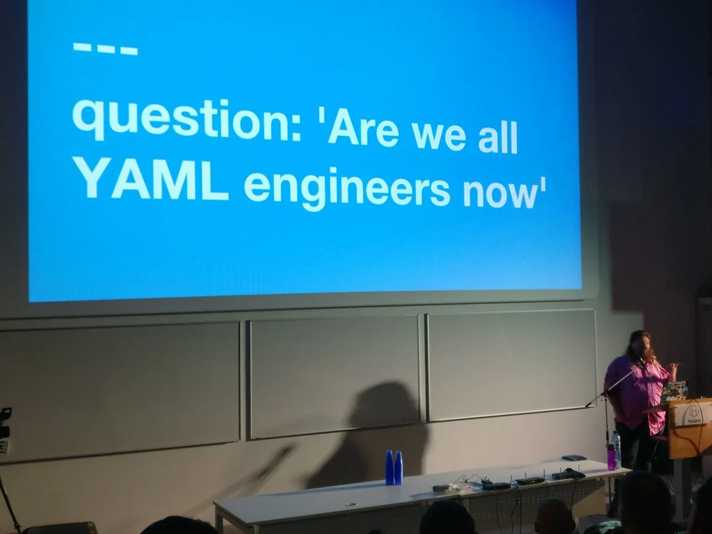

# Homeserver

IaC effort for homeserver.

Push env to main (CHAD!)

- [Just](https://github.com/casey/just): taskrunner
- Ans
- Tailscale
- Docker

`just --list` List all available commands
`just start nginx` 
`just start actual-budget`
